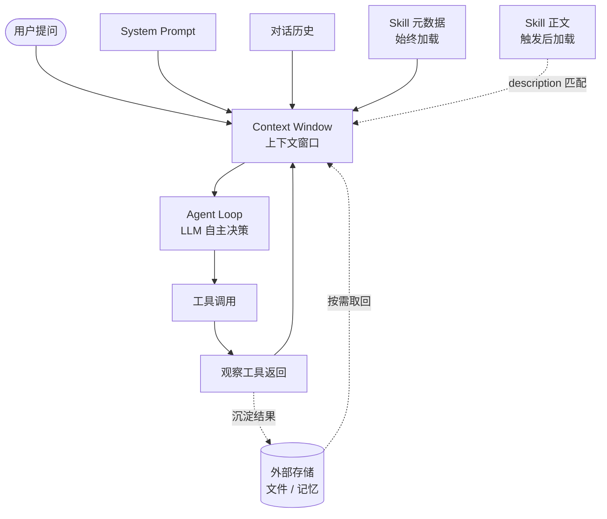

# 三个概念之间的关系（Agent · 大模型的上下文 · Skill）

> 本文件是 `concept-relationship.html` 的 Markdown 版本，内容等价。生成日期：2026-09-12。

这三个概念**不在同一层**：

- **大模型的上下文**是 Agent 的"短期舞台"；
- **Agent** 是在这个舞台上跑循环的程序；
- **Skill** 是教会这个程序"按什么流程工作"的手册。

---

## 一、一张图看懂信息流向



**文字版兜底（无需渲染即可读）**：

```
用户提问 ┐
System Prompt ┤
对话历史 ├──▶ [ 上下文窗口 Context ] ──▶ [ Agent Loop ] ──▶ 工具调用
Skill 元数据 ┤                                  ▲                 │
Skill 正文 ──┘（触发后才加载）                    └──── 观察结果 ◀───┘
                                                    │
外部存储（文件 / 记忆）◀── 沉淀结果 ─────────────────┘
                        按需取回 ────────────────────▶ 上下文窗口
```

关键点：凡是进入 Agent 决策视野的信息，都必须先经过**上下文窗口**这一关——Skill、历史、工具返回都不例外。

---

## 二、上下文如何影响 Agent 的工作

Agent 的决策质量由两件事决定：**决策点**（由 LLM 完成）和**上下文里装了什么**。因为 LLM 做每一个决策时，能看见的只有上下文窗口里的 token——**上下文就是 Agent 的短期认知上限**。

### 2.1 三个层面

| 影响维度 | 具体机制 | 失效时的表现 |
|---|---|---|
| **信息完备度**（装得下吗） | 窗口决定能同时容纳多少历史、工具返回与文档片段。装不下就要裁剪，裁剪就意味着丢失。 | 忘记早期约定；重复已做过的事；用户被迫反复重申要求。 |
| **行为约束**（被什么约束） | 系统提示里的角色、边界、工具使用偏好是上下文中的"宪法"，最先影响决策风格。 | 该收敛时不收敛；该调用工具时不用；越出手册范围。 |
| **信噪比与位置**（注意得到吗） | 上下文越长，模型对中段信息的引用能力越低（lost in the middle）。 | 前后矛盾；引用已过时的信息；忽略放在中间的硬约束。 |

### 2.2 同一个任务，三种上下文

任务固定为"调研最近 30 天最热的 5 个 AI Agent 仓库"，只改变上下文：

| 上下文配置 | 典型结果 |
|---|---|
| 只有用户原话，无系统提示 | Agent 自由发挥，可能反复搜索，输出冗长、重点分散 |
| 系统提示规定"最多 3 次工具调用，输出 ≤ 200 字" | 行为明显收敛，输出精炼，但深度有限 |
| 系统提示 + 检索策略类 Skill 被触发加载 | 走专业化路径：先筛后读再抽取，质量与结构同时提升 |

三次差别**只来自上下文**——模型权重、工具集、循环结构都没变。这就是"上下文决定 Agent 上限"最直接的证据。

### 2.3 反过来，Agent 也在塑造自己的上下文

影响是双向的。Agent 每跑一轮都产生新的工具返回，不加管理上下文就会单调膨胀直至触顶。所以成熟的 Agent 必须**主动整理自己的上下文**：压缩历史、把状态写入文件、丢弃低价值的中间结果——这就是上下文工程在 Agent 场景下的落地。

---

## 三、Skill 如何沉淀可复用的任务知识

如果说系统提示是"宪法"，Skill 就是"**手册**"——把某一类任务的经验固定下来，下次遇到相似任务再次调用。区别在于：宪法每次都在，手册要用时才翻。

### 3.1 任务知识的四个沉淀层次

| 层次 | 存放位置 | 谁来维护 | 复用范围 | 是否常驻上下文 |
|---|---|---|---|---|
| **本次会话** | 对话历史 | 用户 + Agent | 仅当前任务 | 是（逐轮累积） |
| **System Prompt** | 每次请求注入 | 开发者手写 | 该应用全部任务 | 是（始终） |
| **Skill** | `.workbuddy/skills/<name>/SKILL.md` | 编写者 / Agent 协助 | 所有 description 匹配的任务 | 元数据常驻，正文按需 |
| **外部知识库** | 向量库 / 文档系统 | 检索服务 | 运行时按需召回 | 否（召回片段才进） |

Skill 的位置很特殊：**兼有 System Prompt 的"自动触发"和知识库的"结构化内容"**。因此特别适合沉淀：

1. **重复性工作流**——"每次都要按这套步骤做"的活儿。
2. **领域规范**——团队约定、领域偏好，不必每次重新交代。
3. **专家经验**——把"老手才会注意的坑"变成可执行的检查项。

### 3.2 从沉淀到复用的生命周期

```
① 沉淀              ② 加载               ③ 复用               ④ 迭代
写 SKILL.md  ──▶  元数据语义匹配  ──▶  按流程执行任务  ──▶  根据反馈修订
（YAML+正文）      命中则加载正文        产出落到约定位置      （修订回写文件）
                                                              │
                                                              └─▶ 回到 ①

收益：写一次 → 任意会话可用 → 团队共享 → 改一处，全部场景同步生效
代价：description 写不准会导致触发失败；写得过宽会导致误触发
```

### 3.3 Skill 与上下文、Agent 的交界

- **与上下文交界**：元数据是"常驻的极小成本"，正文是"按需的较大成本"。用这个分层换来"能力可扩展但上下文不爆"。
- **与 Agent 交界**：Skill 只告诉 Agent"怎么做"，**不替它决定"做不做"**。是否加载、是否遵循，仍由 Agent 在循环中判断——这也是为什么 Skill 不能当强制约束用。

---

## 四、三者协作（一张表）

| 维度 | 大模型的上下文 | Agent | Skill |
|---|---|---|---|
| **本质** | 舞台（每次推理的输入边界） | 在舞台上跑循环的程序 | 交给程序的工作手册 |
| **生命周期** | 一次性（每次推理重新拼装） | 运行时（循环持续到终止） | 持久（文件形式，跨会话） |
| **容量约束** | 受窗口上限约束 | 受最大轮次与成本约束 | 理论上不限（按需加载） |
| **解决的问题** | "能看见什么" | "决定做什么" | "按什么流程做" |
| **主要操作** | 填装、压缩、检索 | 推理、调用、观察 | 加载、引用、迭代 |
| **典型失效信号** | 中段信息被忽略、请求超窗 | 无限循环、错误累积放大 | description 模糊导致不触发 |

### 一句话串起来

> **Skill**（把经验沉淀成文件）→ 被触发后**加载进上下文**（短期舞台）→ **Agent** 基于上下文自主决策、调用工具 → 工具结果回填上下文 → 决定下一步 → 直到终止；过程中产生的稳定结论又可沉淀回文件，形成下一轮的 Skill 迭代。

把这三者当一个整体看：**Skill 写"怎么做"，上下文决定"能看见什么"，Agent 负责"决定做什么"**。三者配合得好，AI 应用就稳定；任意一环失衡，问题就会从那一环暴露出来。

---

## 五、参考来源

1. Anthropic, *Building Effective Agents* — <https://www.anthropic.com/research/building-effective-agents>（agent loop 的定义、workflow 与 agent 的边界）
2. Anthropic, *Effective context engineering for AI agents* — <https://www.anthropic.com/engineering/effective-context-engineering-for-ai-agents>（上下文作为稀缺资源、压缩与即时检索）
3. Liu et al., *Lost in the Middle: How Language Models Use Long Contexts*（2023）— <https://arxiv.org/abs/2307.03172>（中段信息引用准确度下降的实验证据）
4. Anthropic Platform Docs, *Agent Skills Overview* — <https://platform.claude.com/docs/en/agents-and-tools/agent-skills/overview>（三级加载机制与触发方式）
5. Claude Academy, *Context management* — <https://academy.claude.com/courses/claude-platform-101/context-management>（上下文的构成与四种管理模式）
